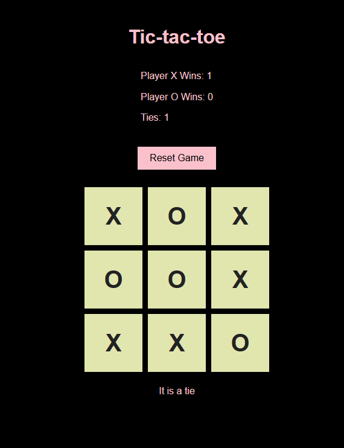

#  Tic-Tac-Toe

### Goal: Create a two player Tic-Tac-Toe game. The users should be able to click to place their X or O and if they win the program should mention their win in the DOM. Please make the game as OOP as possible.

## View:

## Local Preview
Open `index.html` using the VS Code Live Server extension or open the file directly in your browser.

## Built with:
-HTML
-CSS5
-JavaScript

